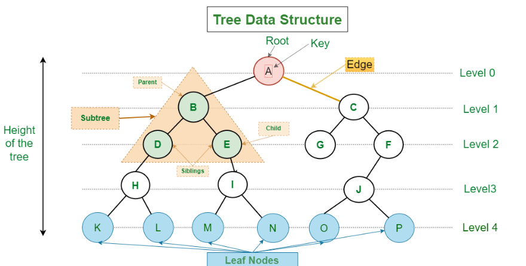

## Trees

**what is the Tree?**
A tree consists of nodes, where each node holds data and references to its child nodes. Connections between nodes are represented by edges. The root node is the topmost node and serves as the starting point for accessing the tree. Nodes can have zero or more child nodes, except for the root node.

Key concepts in tree structures include the root, which is the top node; parents and children, where a parent node has one or more child nodes; siblings, which are nodes with the same parent; leaf nodes, which have no children; and subtrees, which are smaller trees within the main tree.

Trees are used in various algorithms and data structures, including binary trees, binary search trees (BSTs), heaps, tries, balanced trees (e.g., AVL trees, Red-Black trees), and spanning trees.

Binary trees have at most two child nodes per node, and they are employed in algorithms like binary search, heapsort, and expression trees.

BSTs are binary trees with ordered or sorted elements, enabling efficient search, insertion, and deletion operations.

Heaps are complete binary trees that satisfy the heap property, often used in priority queues and sorting algorithms.

Tries are tree-like structures used for efficient retrieval of keys or strings, common in applications such as autocomplete and spell checking.

Balanced trees maintain balance, such as AVL trees and Red-Black trees, ensuring efficient search, insertion, and deletion operations with logarithmic time complexity.

Spanning trees, derived from connected graphs, include all graph vertices and find applications in network design and minimum spanning tree algorithms.

Trees provide an efficient and versatile means of representing and manipulating hierarchical data, making them a fundamental concept in computer science.